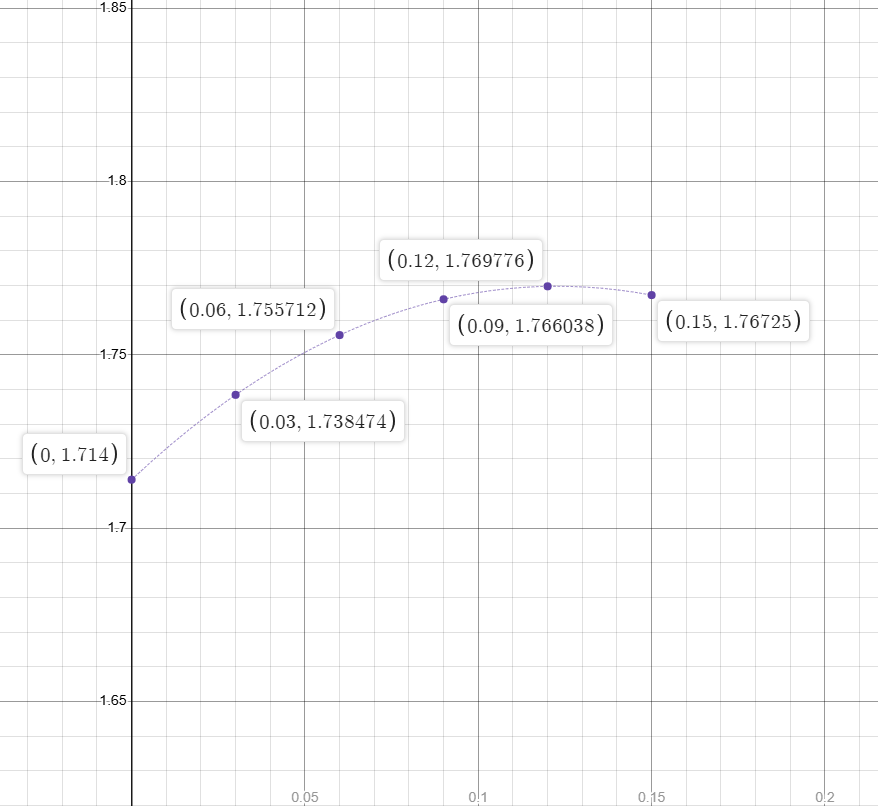

# HODM to FODM Conversion
The `FirstOrderDelayModel::process` method approximates a series of first-order delay models from a single high-order delay model using the Least SQuares (LSQ) approximation algorithm. It takes in the following inputs:

| Input              | Data Type                 | Description
| -                  | -                         | -
| `ho_t_start`       | `double`                  | Start time of the HO model.
| `ho_t_stop`        | `double`                  | Stop time of the HO model.
| `num_ho_coeff`     | `int`                     | Number of coefficients in the HO model.
| `ho_poly`          | `double*`                 | The HO polynomial, as a list of coefficients (in order of degree, e.g. $h(t) = 2t^3+3t-1 \longrightarrow$ `[2, 0, 3, -1]`). Should contain exactly `num_ho_coeff` elements.
| `num_lsq_points`   | `int`                     | The number of points to use for LSQ approximation.
| `num_fo_poly`      | `int`                     | The number of FO models to generate.
| `fo_t_start`       | `vector<double>&`         | A vector of length `num_fo_poly + 1` which contains the start timestamps of each FO model to generate as well as the end time of the final FO model as the final element. Note that these FO timestamps are relative to the same *epoch* as the HO model, NOT relative to the HO model itself (i.e., if `ho_t_start == 1234` and `fo_t_start[0] == 1234`, then the first FO to be generated starts at the *exact start timestamp* of the HO model).
| `fo_poly`          | `vector<long double>&`    | A vector in which to store the generated FO models, one after another, e.g. `[fo0_coeff1, fo0_coeff0, fo1_coeff1, fo1_coeff0, ...]`

A simple explanation of the algorithm:
* We start with a high-order polynomial, e.g. $h(t)=2t^3 - 6t^2 + 4t + 1$. This has a graph which looks like:
  
* The goal of this function is a) to divide this polynomial into several bounded intervals (not necessarily equivalent) and b) to find a single linear equation for each interval which best fits. The actual interval start and end points are determined by the timestamps in the `fo_t_start` array (with the final array element being the end timestamp of the final FO poly). Notes:
  * The timestamp `ho_t_start` and the timestamps in `fo_t_start` are all measured in seconds from the SKA epoch.
  * `ho_t_start` is represented by **$x=0$ of the high-order polynomial**. That is, if `ho_t_start == 0.1`, then the value of the polynomial at $x=0$ represents the delay at a time of 0.1 seconds after the epoch. It then follows that the *difference* between `fo_t_start[i]` and `ho_t_start` is what determines the start of a particular first-order interval. As an example, if `ho_t_start == 0.1` and `fo_t_start == [0.4, 0.55, 0.7]`, then the first-order intervals of the polynomial will be $0.3 \leq t \leq 0.45$ and $0.45 \leq t \leq 0.6$.
  * `ho_t_stop` is only used for input validation and has no further relevance to the calculation.
* For example, selecting `ho_t_start = 0.1`, `num_fo_poly = 10`, and `fo_t_start = [0.4, 0.55, 0.7, 0.85, 1.0, 1.15, 1.3, 1.45, 1.6, 1.75, 1.9]` (note the 11 = 10 + 1 elements), we get the following 10 distinct intervals for which to generate FO models (for simplicity in this example they are equally spaced):
  
* For each of these intervals, we look at `num_lsq_points + 1` equidistant points along that interval. For example, taking the very first interval, and `num_lsq_points = 5`, we get the following points:
  ![An isolated plot of the high-order polynomial over the interval [fo_t_start[0], fo_t_start[1]], along with the 6 LSQ points.](03_ho_segment_with_lsq_points.png "An isolated plot of the high-order polynomial over the interval [fo_t_start[0], fo_t_start[1]], along with the 6 LSQ points.") 
* Then, we shift the LSQ points horizontally so that the first point lies at $x=0$ (such that $x=0$ relative to these points now represents the `fo_t_start` time). This is because we want the resulting fit line to start from the `fo_t_start` time instead of from `ho_t_start`:
  
  
* Now, to find a best linear fit for this interval, we effectively want to find a line which passes through each of these points, i.e., we want to solve the following system of linear equations of the form $y(t)=a+tb$:
  $$
  \begin{aligned}
  1.714 &= a + 0.0b \\
  1.738474 &= a + 0.03b \\
  1.755712 &= a + 0.06b \\
  1.766038 &= a + 0.09b \\
  1.769776 &= a + 0.12b \\
  1.76725 &= a + 0.15b \\
  \end{aligned}
  $$
* We start by defining the following matrices to represent this system:
  $$
  \mathbf{y} = \begin{bmatrix}
  1.714 \\
  1.738474 \\
  1.755712 \\
  1.766038 \\
  1.769776 \\
  1.76725
  \end{bmatrix} \qquad
  \mathbf{X} = \begin{bmatrix}
  1 & 0.0 \\
  1 & 0.03 \\
  1 & 0.06 \\
  1 & 0.09 \\
  1 & 0.12 \\
  1 & 0.15 \\
  \end{bmatrix} \qquad
  \mathbf{f} = \begin{bmatrix}
  a \\
  b \\
  \end{bmatrix}
  $$
  where $\mathbf{y}$ holds the results of the equations, $\mathbf{X}$ holds the coefficients, and $\mathbf{f}$ holds the best-fit solution to the system, such that
  $$
  \mathbf{y} = \mathbf{X}\mathbf{f}
  $$
* Without going into detail, it is a fact that based on the above, the best-fitting solution using the linear least squares method is:
  $$
  \mathbf{f} = (\mathbf{X}^T\mathbf{X})^{-1}(\mathbf{X}^T\mathbf{y})
  $$

* We then calculate the matrices $\mathbf{X}^T\mathbf{X}$ (`xtx`), $(\mathbf{X}^T\mathbf{X})^{-1}$ (`xtx_inv`), and $\mathbf{X}^T\mathbf{y}$ (`xty`).
  Recall that the inverse $\mathbf{A}^{-1}$ of an invertible 2x2 matrix $\mathbf{A} = \begin{bmatrix}a & b \\ c & d\end{bmatrix}$ is calculated via:
  $$
  \mathbf{A}^{-1} = \frac{1}{det(\mathbf{A})} \begin{bmatrix}
  d & -b \\
  -c & a
  \end{bmatrix}
  $$
  where $det(\mathbf{A}) = (ad - bc)$.
  Then:
  $$
  \mathbf{X}^T\mathbf{X} = \begin{bmatrix}
  1 & 1 & 1 & 1 & 1 & 1 \\
  0.0 & 0.03 & 0.06 & 0.09 & 0.12 & 0.15 \\
  \end{bmatrix} \begin{bmatrix}
  1 & 0.0 \\
  1 & 0.03 \\
  1 & 0.06 \\
  1 & 0.09 \\
  1 & 0.12 \\
  1 & 0.15 \\
  \end{bmatrix} = \begin{bmatrix}
  6 & 0.45 \\
  0.45 & 0.0495 \\
  \end{bmatrix} \\
  (\mathbf{X}^T\mathbf{X})^{-1} = \frac{1}{(6 \cdot 0.0495) - (0.45 \cdot 0.45)} \begin{bmatrix}
  0.0495 & -0.45 \\
  -0.45 & 6 \\
  \end{bmatrix} = \begin{bmatrix}
  0.523809 & -4.761904 \\
  -4.761904 & 63.492063 \\
  \end{bmatrix} \\
  \mathbf{X}^T\mathbf{y} = \begin{bmatrix}
  1 & 1 & 1 & 1 & 1 & 1 \\
  0.0 & 0.03 & 0.06 & 0.09 & 0.12 & 0.15 \\
  \end{bmatrix} \begin{bmatrix}
  1.714 \\
  1.738474 \\
  1.755712 \\
  1.766038 \\
  1.769776 \\
  1.76725 \\
  \end{bmatrix} = \begin{bmatrix}
  10.51125 \\
  0.79390098 \\
  \end{bmatrix}
  $$
* We can now use these matrices to solve for $\mathbf{f}$:
  $$
  \begin{aligned}
  \mathbf{f} &= (\mathbf{X}^T\mathbf{X})^{-1}(\mathbf{X}^T\mathbf{y}) \\
  &= \begin{bmatrix}
  0.523809 & -4.761904 \\
  -4.761904 & 63.492063 \\
  \end{bmatrix} \begin{bmatrix}
  10.51125 \\
  0.79390098 \\
  \end{bmatrix} \\
  &= \begin{bmatrix}
  1.725412 \\
  0.35284 \\
  \end{bmatrix} = \begin{bmatrix}
  a \\
  b \\
  \end{bmatrix}
  \end{aligned}
  $$
  and thus find our linearly-fit first-order polynomial for the 0th interval to be $f_0(t) = a + tb = 0.35284t + 1.725412$:
  
* We then repeat this process for each of the remaining intervals.
